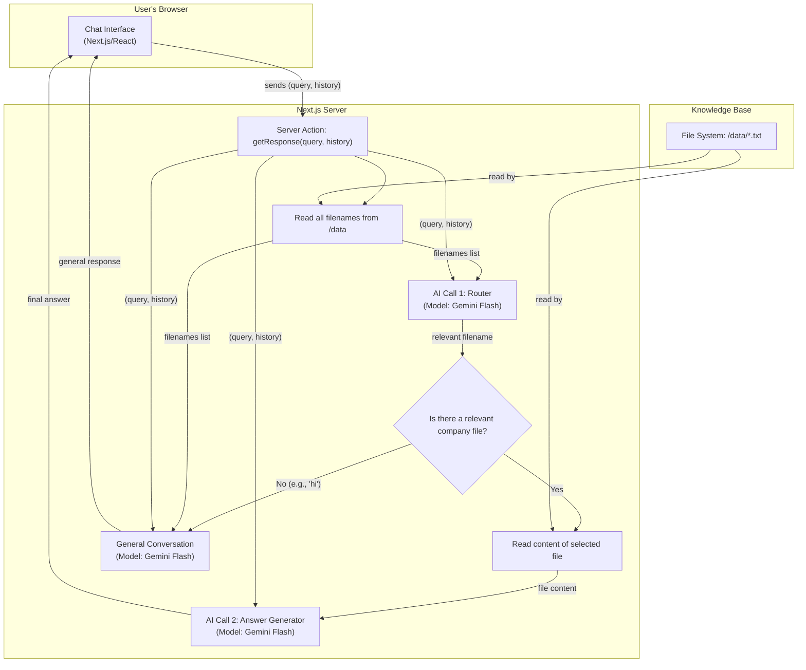

# Connecto: AI Career Assistant Chatbot

## 1. Project Overview & Purpose

Connecto is an intelligent, conversational AI chatbot designed to assist students and job seekers. Its primary purpose is to provide instant and accurate information about company hiring processes, salary expectations, required skills, and roles, based on a curated knowledge base.

**Key Features:**
- **Natural Conversation:** Users can ask questions in a natural way and ask follow-up questions, as the chatbot maintains the context of the conversation.
- **Scalable Knowledge Base:** The chatbot's knowledge is sourced directly from text files, making it easy to add information for hundreds of companies without changing any code.
- **Efficient & Accurate:** It uses a two-step AI process to first identify the user's topic and then generate a focused answer, ensuring high accuracy and performance.

---

## 2. Content Management Guide (How to Update the Chatbot's Knowledge)

You can add, edit, or remove company information without writing any code. The chatbot's knowledge lives entirely within the text files located in the `/src/data` directory of this repository.

### How to Edit an Existing Company's Information

1.  Navigate to the `src/data` folder in the GitHub repository.
2.  Click on the file you wish to edit (e.g., `tcs.txt`).
3.  Click the **pencil icon (Edit)** in the top-right corner of the file view.
4.  Make your desired changes to the text.
5.  Scroll to the bottom, add a brief commit message (e.g., "Updated TCS salary details"), and save the changes.

### How to Add a New Company

1.  Navigate to the `src/data` folder.
2.  Click the **"Add file"** button and select **"Create new file"**.
3.  In the filename box, enter the name for the new company (e.g., `google.txt`).
4.  In the editor, paste or write the information for the new company.
5.  Scroll to the bottom, add a commit message (e.g., "Added Google hiring info"), and save the file.

**Important:** Any changes committed to the main branch will automatically trigger a new deployment on Vercel, and the chatbot will be updated with the new information.

---

## 3. Technical Architecture

The application is built on a modern, serverless stack designed for scalability and performance.

**Core Technologies:**
- **Framework:** Next.js (React)
- **AI/LLM:** Google Gemini
- **Hosting:** Vercel

### Architecture Diagram

The system uses a two-step AI process to handle user queries efficiently.

1.  **Router AI:** First, an AI model identifies the user's intent and selects the most relevant document from the knowledge base.
2.  **Answer Generator AI:** A second AI model then receives only the relevant document and generates a precise answer.

This prevents the AI from being overwhelmed and ensures it can scale to handle a large number of documents.



---

## 4. Setup and Deployment (For Developers)

### Prerequisites
- Node.js
- npm or yarn

### Local Development
1.  **Clone the repository:**
    ```bash
    git clone <your-repo-url>
    ```
2.  **Navigate to the project directory:**
    ```bash
    cd <project-directory>
    ```
3.  **Install dependencies:**
    ```bash
    npm install
    ```
4.  **Set up Environment Variables:**
    Create a file named `.env.local` in the root of the project and add your API keys:
    ```
    OPENROUTER_API_KEY=your_api_key_here
    ```
5.  **Run the development server:**
    ```bash
    npm run dev
    ```
    The application will be available at `http://localhost:3000`.

### Deployment
The application is configured for seamless deployment to [Vercel](https://vercel.com/). Simply connect your GitHub repository to a new Vercel project, and it will deploy automatically on every push to the main branch.
