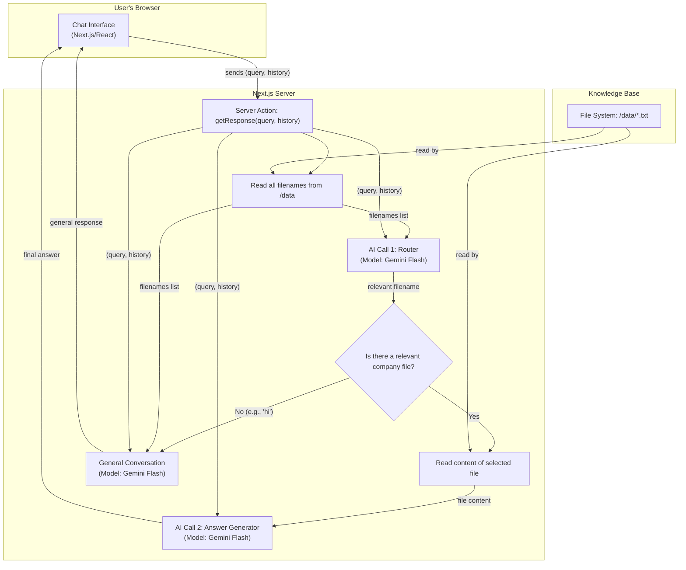

# Connecto: AI Career Assistant Chatbot

## 1. Project Overview & Purpose

Connecto is an intelligent, conversational AI chatbot designed to assist students and job seekers. Its primary purpose is to provide instant and accurate information about company hiring processes, salary expectations, required skills, and roles, based on a curated knowledge base.

**Key Features:**
- **Natural Conversation:** Users can ask questions in a natural way and ask follow-up questions, as the chatbot maintains the context of the conversation.
- **Scalable Knowledge Base:** The chatbot's knowledge is sourced directly from text files, making it easy to add information for hundreds of companies without changing any code.
- **Efficient & Accurate:** It uses a two-step AI process to first identify the user's topic and then generate a focused answer, ensuring high accuracy and performance.

---

## 2. Content Management Guide (How to Update the Chatbot's Knowledge)

You can add, edit, or remove company information without writing any code. The chatbot's knowledge lives entirely within the text files located in the `/src/data` directory of this repository.

### How to Edit an Existing Company's Information

1.  Navigate to the `src/data` folder in the GitHub repository.
2.  Click on the file you wish to edit (e.g., `tcs.txt`).
3.  Click the **pencil icon (Edit)** in the top-right corner of the file view.
4.  Make your desired changes to the text.
5.  Scroll to the bottom, add a brief commit message (e.g., "Updated TCS salary details"), and save the changes.

### How to Add a New Company

1.  Navigate to the `src/data` folder.
2.  Click the **"Add file"** button and select **"Create new file"**.
3.  In the filename box, enter the name for the new company (e.g., `google.txt`).
4.  In the editor, paste or write the information for the new company.
5.  Scroll to the bottom, add a commit message (e.g., "Added Google hiring info"), and save the file.

**Important:** Any changes committed to the main branch will automatically trigger a new deployment on Vercel, and the chatbot will be updated with the new information.

---

## 3. Technical Architecture

The application is built on a modern, serverless stack designed for scalability and performance.

**Core Technologies:**
- **Framework:** Next.js (React)
- **AI/LLM:** Google Gemini
- **Hosting:** Vercel

### Architecture Diagram

The system uses a two-step AI process to handle user queries efficiently.

1.  **Router AI:** First, an AI model identifies the user's intent and selects the most relevant document from the knowledge base.
2.  **Answer Generator AI:** A second AI model then receives only the relevant document and generates a precise answer.

This prevents the AI from being overwhelmed and ensures it can scale to handle a large number of documents.



---

## 4. Setup and Deployment (For Developers and Production)

### Prerequisites
- Node.js
- npm or yarn
- A Vercel account (for production deployment)

### Local Development
1.  Clone and install:
    ```bash
    git clone <your-repo-url>
    cd <project-directory>
    npm install
    ```
2.  Set up Environment Variables (Server-only). At least one AI provider key is required:
    ```
    # Option A: Use OpenRouter (recommended)
    OPENROUTER_API_KEY=your_openrouter_key

    # Option B: Use Google Gemini directly
    GEMINI_API_KEY=your_gemini_key
    ```
    Notes:
    - These variables are SERVER-ONLY. Do not expose in client code. There is no NEXT_PUBLIC_GEMINI_API_KEY.
    - In Vercel, set these via Project Settings → Environment Variables.
3.  Run the development server:
    ```bash
    npm run dev
    ```
    The application will be available at http://localhost:3000.

### Production Deployment to Vercel

1. Create a Vercel project and import this repository.
2. Framework preset: Next.js. Default build command is fine.
3. Set environment variables (Production, Preview):
   - OPENROUTER_API_KEY or GEMINI_API_KEY (at least one required)
   - Optional auth (feature-flag): ENABLE_AUTH, NEXTAUTH_URL, NEXTAUTH_SECRET, and OAuth provider secrets (GitHub/Google) if enabling.
   - Optional: NEXT_PUBLIC_APP_VERSION
4. Select a region close to your users. You can expand to multiple regions later.
5. Deploy. Each push to main triggers a new deployment.

Post-deploy checks:
- GET /api/health returns 200 with status: "ok"
- POST /api/chat with a sample payload returns an AI-generated reply
- Excessive requests to an API path (>60/min/IP) eventually return 429 per in-memory limiter

### Environment Variables Reference (Production)

| Name | Required | Scope | Description |
| --- | --- | --- | --- |
| OPENROUTER_API_KEY | One of OPENROUTER_API_KEY or GEMINI_API_KEY required | Server | OpenRouter API key for Gemini proxy. |
| GEMINI_API_KEY | One of OPENROUTER_API_KEY or GEMINI_API_KEY required | Server | Google Gemini API key. |
| ENABLE_AUTH | Optional | Server | Enable NextAuth routes when set to "true". |
| NEXTAUTH_SECRET | Required if ENABLE_AUTH=true | Server | Secret for NextAuth. |
| NEXTAUTH_URL | Required if ENABLE_AUTH=true | Server | Public URL for NextAuth callbacks. |
| GITHUB_ID / GITHUB_SECRET | Optional | Server | OAuth credentials if enabling GitHub auth. |
| GOOGLE_CLIENT_ID / GOOGLE_CLIENT_SECRET | Optional | Server | OAuth credentials if enabling Google auth. |
| NEXT_PUBLIC_APP_VERSION | Optional | Public | Version string for UI/telemetry. |

### Security and Rate Limiting

- Middleware enforces security headers (CSP, Referrer-Policy, X-Content-Type-Options, X-Frame-Options, COOP/CORP, Permissions-Policy) and CORS (same-origin by default).
- Rate limiting defaults to 60 req/min per IP+path. Headers: RateLimit-Limit, RateLimit-Remaining, RateLimit-Reset.
- For multi-region/global enforcement, migrate limiter storage to Redis. See docs/security-and-rate-limiting.md.

### Health and API Endpoints

- Health: GET /api/health → liveness/readiness JSON. Source: src/app/api/health/route.ts
- Chat: POST /api/chat → JSON response with AI output. Source: src/app/api/chat/route.ts
- Knowledge:
  - GET /api/knowledge/list → list of available items
  - GET /api/knowledge/item/[company]?format=text|json → content for a company

For a complete production operations guide (runbooks, scaling, monitoring), see kavia-docs/production-deployment.md.

---

## 5. Authentication (Feature-Flagged)

This project includes a scaffolded NextAuth setup that is disabled by default to avoid changing current public behavior. All existing endpoints remain public unless you explicitly add protection.

- Docs: `docs/auth.md`
- To enable: set `ENABLE_AUTH=true` and configure provider secrets in `.env` (see `.env.example`).
- Only wrap future admin/write routes with `requireAuth` from `src/lib/auth.ts`. Public endpoints should remain unwrapped unless you intentionally want to protect them.
